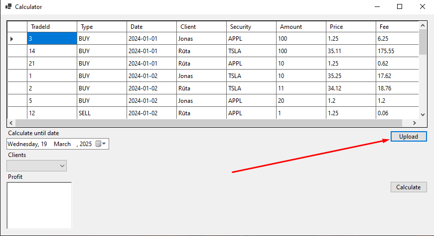

# FIFO-Profit-Loss-calculator
A windows form that calculates stock profits using FIFO method

## Tools used
1. Visual Studio 2022
2. .NET 8
3. [FIFO method](https://www.help.saxo/hc/en-us/articles/360041450651-How-do-I-calculate-PnL-FIFO-Method)

## Instructions
1. Upload a CSV document with the sales data (data.csv file provided as a template).

2. Choose the date and the client you wish to calculate the profits for.

3. Once filters have been chosen, click on the calulate button.
4. Result data will be shown in the Profit textbox below the Client dropdown list.